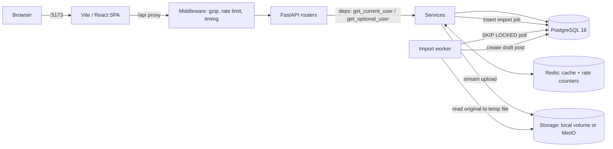
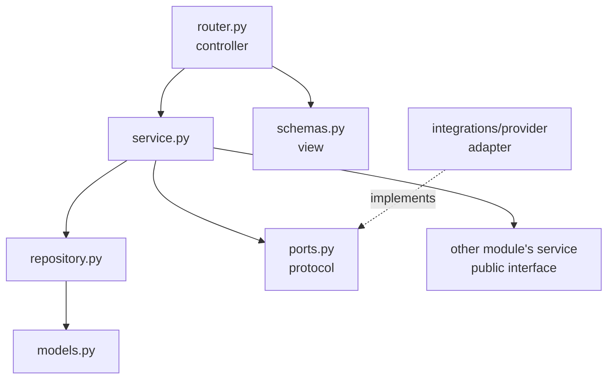
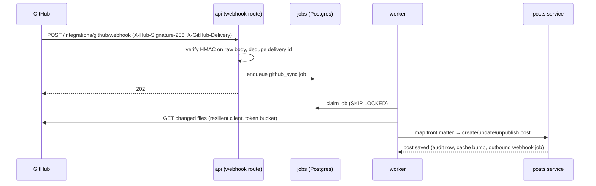
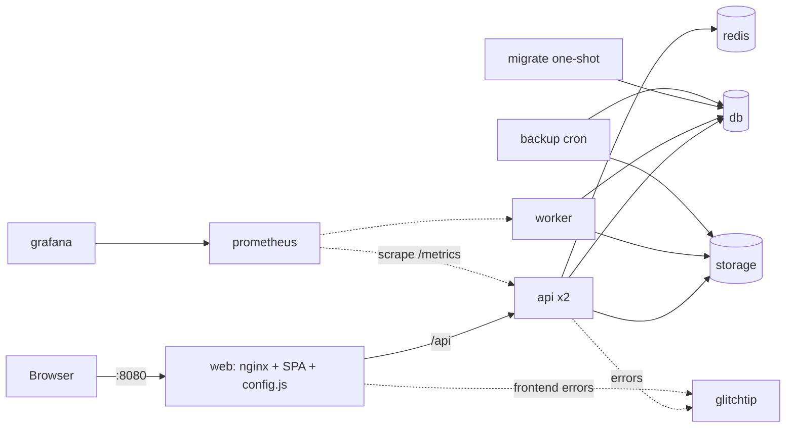
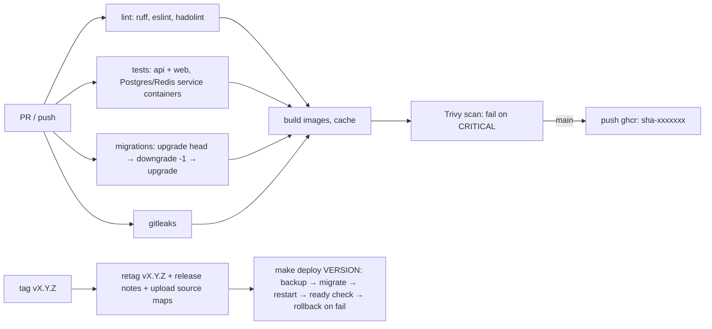

# Architecture — Blog Platform
_Last reviewed: 2026-09-28 · Status: v1 target + v2 (import/export/perf) + v3 (identity, sessions, tenancy) + v4 (RBAC, audit, containers, CI/CD, observability, backups) + v5 (MVC/repositories, REST v2, third-party integrations)_

## Stack
| Layer | Technology | Version | Notes |
|---|---|---|---|
| Frontend | React + Vite + TypeScript (strict) | latest stable at T-001, pinned in lockfile | SPA; React Router; TanStack Query for server state |
| UI | Tailwind CSS + shadcn/ui | pinned at T-001 | react-markdown for rendering (no rehype-raw) |
| Backend | FastAPI (Python 3.12) | pinned at T-001 | Pydantic v2; managed with `uv` |
| ORM / migrations | SQLAlchemy 2.0 + Alembic | pinned at T-001 | sync engine + psycopg 3 (async not needed at this scale) |
| Auth | JWT (PyJWT) in HttpOnly cookie; argon2id via `pwdlib` | pinned at T-001 | v3: 15-min access + rotating refresh; OIDC client via Authlib for Google/Microsoft/Yahoo/Apple |
| Data | PostgreSQL | 16 | Docker volume; separate test database |
| Infra | Docker Compose | v2 | v4: `compose.yaml` + `compose.dev.yaml` / `compose.prod.yaml`; profiles `s3`, `obs` |
| Cache / rate limit | Redis | 7 | cache-aside + fixed-window counters; API fails open if Redis is down |
| Object storage | Local volume (default) or MinIO (S3 API) via boto3 | MinIO latest at T-021 | `STORAGE_BACKEND=local|s3` |
| Job worker | Same backend image, `python -m app.workers.import_worker` | | DB-backed queue using `FOR UPDATE SKIP LOCKED` |
| Import parsing | mammoth + markdownify (.docx); pdfplumber (.pdf) | pinned at T-021 | all permissive licences; runs only in worker |
| Export | csv (stdlib), openpyxl (write-only mode), reportlab | pinned at T-021 | |
| Load testing | Locust | pinned at T-021 | `backend/loadtest/locustfile.py` |
| Testing | pytest + httpx TestClient; Vitest; Playwright (Should) | | v3: local fake OIDC provider for OAuth tests |
| Web serving (prod) | nginx-unprivileged | pinned at T-069 | serves built SPA + `config.js`, proxies `/api` |
| Logging | stdlib `logging` + python-json-logger | pinned at T-073 | JSON to stdout |
| Metrics | prometheus-client; Prometheus + Grafana (profile `obs`) | pinned at T-074 | dashboards provisioned from `deploy/grafana/` |
| Error tracking | sentry-sdk / @sentry/react → GlitchTip (profile `obs`) or Sentry SaaS | pinned at T-075 | `SENTRY_DSN` empty = disabled |
| CI/CD | GitHub Actions; GHCR; hadolint, gitleaks, Trivy | — | `.github/workflows/ci.yml`, `release.yml` |
| Backups | `postgres:16` image running `pg_dump -Fc` on a schedule | 16 (must match server major) | `ops/backup/` |
| Outbound HTTP (v5) | httpx (+ respx in tests) | pinned at T-092 | wrapped by `app/integrations/http.py` |
| AI provider (v5) | Anthropic Messages API via official Python SDK | pinned at T-094 | model from `ANTHROPIC_MODEL`; docs https://docs.claude.com/en/api/overview |
| Crypto (v5) | `cryptography` AES-GCM | pinned at T-093 | user integration credentials at rest |
| Architecture checks (v5) | import-linter | pinned at T-086 | contracts in `backend/.importlinter` |
| API client codegen (v5) | openapi-typescript | pinned at T-087 | `frontend/src/api/generated/` |
| Repo workflow (v5) | pre-commit, commitlint, Dependabot | pinned at T-082 | |

## System overview
The browser loads the React SPA from Vite (:5173). All API calls go to `/api/*`, which the Vite dev server
proxies to FastAPI (:8000) — so the browser sees one origin and the auth cookie is first-party.
FastAPI routers validate input with Pydantic, resolve the current user from the cookie via a dependency,
and call a service. Services enforce every ownership/visibility rule and talk to PostgreSQL through SQLAlchemy.
Responses are always Pydantic schemas, never ORM objects.



### Import flow (v2)
1. `POST /imports` (multipart). For each file the API streams 64 KB chunks: counts bytes (abort at 10 MB), hashes SHA-256, sniffs magic bytes from the first chunk, and writes to storage under a server-generated key. The whole file is never held in memory.
2. Valid files → `imports` row `status=queued`; response 202 lists accepted and rejected files.
3. Worker claims one job (`SELECT … WHERE status='queued' ORDER BY created_at FOR UPDATE SKIP LOCKED LIMIT 1`), copies the original to a temp dir, parses it, and creates a DRAFT post in one transaction with the job update. Temp dir removed in `finally`.
4. Frontend polls `GET /imports/{id}` every 2 s until `succeeded`/`failed`.
5. Jobs stuck in `processing` > 5 min are re-queued by the worker; after 3 attempts → `failed` `WORKER_TIMEOUT`.

### Caching (v2)
- Cache-aside in Redis for ANONYMOUS feed pages and post detail only. Key = `feed:v{N}:{sha1(normalised query)}` / `post:v{N}:{slug}`, TTL 60 s.
- Invalidation: any create/edit/publish/unpublish/delete of a published post, and any like/comment, increments `content:version` (N) — old keys simply expire.
- Personalised fields (`liked_by_me`, `is_owner`, `can_delete`) are never cached; they are computed per request (one batched query) and overlaid.
- HTTP: `ETag` on post detail and feed; `If-None-Match` → 304. Anonymous: `Cache-Control: public, max-age=30`; logged in: `private, no-cache`. `Vary: Cookie`.

### Rate limiting & compression (v2)
- Middleware + per-route dependency; Redis `INCR` + `EXPIRE` fixed windows; key = route bucket + user id (or client IP when anonymous). Limits in rules.md BR-25.
- `GZipMiddleware(minimum_size=1024)` for JSON/CSV; PDF, XLSX and original-file downloads are already compressed and excluded.

### Auth flow (v1 — superseded by the v3 flow below; kept for history)
1. `POST /auth/login` → service verifies argon2 hash → issues JWT `{sub: user_id, exp: now + JWT_EXPIRE_MINUTES}`.
2. Response sets cookie `access_token` (`HttpOnly`, `SameSite=Lax`, `Path=/`, `Secure` if `COOKIE_SECURE`).
3. Protected routes use `get_current_user` (401 if missing/invalid/expired).
   Public routes that personalise (`liked_by_me`, `is_owner`, author viewing own draft) use `get_optional_user`.
4. `POST /auth/logout` deletes the cookie. No refresh tokens, no server-side session table (v1).

### Session flow (v3)
1. Any successful login (password or OIDC) creates a `sessions` row (`sid`, `family_id`) and sets two cookies:
   `access_token` (JWT, 15 min, `Path=/`) and `refresh_token` (opaque, 7 days sliding / 30 days absolute, `Path=/api/v1/auth/refresh`). Both `HttpOnly`, `SameSite=Lax`.
2. JWT claims: `iss`, `aud`, `sub`, `sid`, `iat`, `exp`, `kid`, `tv` (token_version). No email, roles or tenant.
3. On 401 the SPA calls `POST /auth/refresh` once (single shared promise for parallel requests); the refresh token is rotated; a rotated token presented again revokes the whole family (BR-39).
4. `get_current_user` checks signature by `kid`, claims, `tv == users.token_version`, session not revoked, user not suspended (v4).

### OIDC login flow (v3)
1. `GET /auth/oauth/{provider}/start?next=/path` → creates `state`, `nonce`, PKCE verifier; stores them in a signed short-lived cookie; redirects to the provider.
2. Provider → `GET` (or Apple `POST form_post`) `/auth/oauth/{provider}/callback` → validate state → exchange code server-side with client secret + verifier → validate ID token against cached JWKS (`iss`, `aud`, `exp`, `nonce`).
3. Look up `user_identities (provider, sub)`: found → log in; not found and email not used locally → create user + personal publication; email already used → redirect `/login?error=ACCOUNT_EXISTS_LINK_REQUIRED` (BR-31).
4. Redirect to sanitised `next` (BR-37). Every outcome is written to the audit log (v4).

### Tenancy (v3)
Tenant = publication. Tenant context is resolved from the path `/api/v1/pubs/{pub_slug}/…` by `get_tenant_context`, which loads the publication and the caller's membership (if any). Every tenant-scoped service takes `TenantContext` and filters by `publication_id`. v1 routes `POST /posts`, `PATCH/DELETE /posts/{id}` remain as compatibility routes: create targets the caller's personal publication; update/delete resolve the post's publication and run the same guards.

### Authorisation model (v4)
- **Permissions** are strings `resource:action[:scope]` defined as constants in `app/authz/permissions.py` (scope `own` | `any`).
- **Roles** are bundles defined in `app/authz/roles.py` — the only role→permission mapping (BR-61). Publication roles: writer, editor, owner. Platform roles: moderator, admin. Implicit role `member` = every authenticated user.
- **Effective permissions** per request = publication-role perms (for the tenant in the path) ∪ `member` perms ∪ platform-role perms that apply to platform resources only (BR-62). Resolved per request, never stored in the JWT.
- **Guards** are FastAPI dependencies composed in a fixed order (BR-63):
  `get_current_user` → `ensure_not_suspended` → `get_tenant_context` → `load_resource` (tenant-scoped) → `require_permission(perm)` (checks `any`, else `own` against ownership).
- **Policy** lives in `app/authz/policy.py`: `can(actor, permission, resource, ctx) -> Decision(allowed, reason)`. Routes never branch on role names.
- **Denials** raise `Forbidden`/`NotFound` per BR-41 and write a throttled `authz` audit row.
- `docs/permissions.md` is generated from the code (`make permissions-doc`); a test fails if it is stale.

### Audit log (v4)
Single append-only table `audit_log`, written through `audit_service.record(...)` inside the same DB transaction as the action. The app DB role has only `INSERT, SELECT` on it; a retention job running as `blog_maintenance` deletes rows older than 365 days. v3's planned `auth_events` table is not created — auth events are `category='auth'` rows.

### Database roles (v4, least privilege)
| Role | Rights | Used by |
|---|---|---|
| `blog_migrator` | owns schema; DDL | one-shot `migrate` service only |
| `blog_app` | SELECT/INSERT/UPDATE/DELETE on app tables; INSERT/SELECT only on `audit_log`; no DDL | api, worker |
| `blog_backup` | read-only on all tables (for `pg_dump`) | backup service |
| `blog_maintenance` | DELETE on `audit_log`, `sessions`, expired `invites` | retention job |
Default privileges are granted by the migrator so new tables are covered automatically.

## MVC mapping (v5)
This is an API backend plus a separate SPA, so "MVC" maps as follows:
| MVC role | In this codebase | Must not |
|---|---|---|
| Model | `modules/*/models.py` (SQLAlchemy) + `modules/*/repository.py` (all SQL) | contain HTTP or permission logic |
| View | `modules/*/schemas.py` response models (the API representation) + React components that render them | contain business rules |
| Controller | `modules/*/router.py` (FastAPI): parse → guard → call service → return schema | contain SQL or business rules |
| Service (added layer) | `modules/*/service.py`: business rules, transactions, calls to other modules' services and integration ports | import `fastapi` |
| Integration adapter | `app/integrations/<provider>/`: implements a module's `ports.py` protocol | import module internals |



## Directory map (v5 target — supersedes the `backend/app/` part below once T-084 lands)
```
backend/app/
  main.py                # app factory: middleware, exception handlers, mounts api/v1 + api/v2 routers
  api/v1/__init__.py     # includes module routers under /api/v1
  api/v2/__init__.py     # includes v2 routers (posts, comments, likes) under /api/v2
  core/                  # config, errors (domain + problem+json), security, db session, pagination, idempotency, etag
  modules/
    auth/ users/ publications/ posts/ comments/ likes/ imports/ exports/ moderation/ audit/ admin/ integrations/ tokens/
      router.py  router_v2.py (posts/comments/likes only)  schemas.py  service.py  repository.py  models.py  mappers.py  ports.py
  integrations/          # adapters to external systems
    http.py              # resilient client: timeouts, retries, backoff, Retry-After, token buckets, SSRF guard, metrics
    anthropic/  devto/  github/   # client.py, mapper.py, errors.py (+ github/webhooks.py)
  authz/ tenancy/ storage/ importers/ exporters/ workers/ middleware/ observability/   # cross-cutting (unchanged)
```

## Directory map
```
backend/
  app/
    api/v1/        # routers: auth.py, posts.py, likes.py, comments.py, health.py — thin, no logic
    core/          # config.py (settings), security.py (hash, JWT), deps.py, errors.py, logging.py
    models/        # SQLAlchemy ORM: user.py, post.py, like.py, comment.py
    schemas/       # Pydantic request/response models
    services/      # business rules + queries: auth_service.py, post_service.py, like_service.py, comment_service.py,
                   #   import_service.py, export_service.py, cache_service.py, ratelimit_service.py
    storage/       # base.py (StorageBackend protocol), local.py, s3.py, naming.py
    importers/     # sniff.py (magic bytes, zip-bomb check), docx_importer.py, pdf_importer.py
    exporters/     # csv_export.py, xlsx_export.py, pdf_export.py
    workers/       # import_worker.py (poll loop, retries, temp-dir handling)
    middleware/    # timing.py (Server-Timing + query count, local only), ratelimit.py, request_id.py, security_headers.py, origin_check.py
    auth/          # (v3) oidc/ (provider registry, google.py, microsoft.py, yahoo.py, apple.py), sessions.py, tokens.py (kid keys)
    tenancy/       # (v3) context.py (TenantContext + dependency), scoping.py
    authz/         # (v4) permissions.py, roles.py (THE mapping), policy.py, guards.py, docs_gen.py
    observability/ # (v4) logging.py (JSON + redaction), metrics.py, errors.py (Sentry init + scrubbing), health.py
    db/            # session.py, base.py
    main.py        # app factory, router registration, exception handlers
  alembic/         # migrations
  scripts/seed.py, seed_perf.py, explain.py, grant_admin.py, retention.py
  Dockerfile       # (v4) multi-stage; api and worker share this image
  loadtest/        # locustfile.py
  tests/fixtures/files/  # sample .docx/.pdf incl. malicious and edge cases
  tests/           # api/ (endpoint tests), services/ (unit tests), conftest.py
frontend/
  src/
    api/           # client.ts (fetch wrapper) + typed endpoint functions
    features/      # auth/, posts/, comments/, likes/ — hooks + feature components
    components/    # shared UI (layout, shadcn/ui components)
    pages/         # route-level screens
    lib/           # utils
  e2e/             # Playwright smoke test
  Dockerfile       # (v4) build stage (node) → nginx-unprivileged runtime
  docker/          # nginx.conf, 40-config-js.sh (writes config.js from env at container start)
docs/              # context docs + deliverables (api.md, usage.md, performance.md, TOPICS.md, perf/plans/)
deploy/            # (v4) compose.yaml, compose.dev.yaml, compose.prod.yaml, prometheus/, grafana/ (provisioning + dashboards), glitchtip/
ops/backup/        # (v4) backup.sh, restore_test.sh, retention policy
docs/runbooks/     # (v4) restore.md, key-rotation.md, release-rollback.md
.github/workflows/ # (v4) ci.yml, release.yml
Makefile · .env.example · README.md
```

## Key components
| Component | Responsibility | Depends on |
|---|---|---|
| `core/security.py` | Hash/verify passwords; encode/decode JWT | settings |
| `core/deps.py` | `get_db`, `get_current_user`, `get_optional_user` | security, db |
| `core/errors.py` | Domain exceptions + single handler mapping to error envelope | — |
| `auth_service` | Register, authenticate | models, security |
| `post_service` | CRUD, publish/unpublish, visibility, feed with counts | models |
| `like_service` | Idempotent like/unlike, self-like rule | post_service |
| `comment_service` | Create, list, delete with permission rule | post_service |
| `frontend/src/api/client.ts` | Single fetch wrapper: `credentials: 'include'`, JSON, error envelope → typed error | — |
| `features/auth` | `useMe()` query drives all auth-aware UI | api client |
| `storage/*` | `put_stream`, `open_stream`, `delete`, `signed_url(key, ttl)` — one interface, two backends | settings |
| `import_service` | Stream + validate upload, dedupe, enqueue job | storage, importers/sniff |
| `import_worker` | Claim job, parse in temp dir, create draft, retries | importers, post_service, storage |
| `export_service` | Streamed CSV via server-side cursor (`yield_per(500)`); XLSX/PDF built in temp file then streamed | exporters |
| `cache_service` | Key building, version bump, get/set with JSON | Redis |
| `ratelimit_service` | Check/increment windows, return retry-after | Redis |
| `middleware/timing` | `Server-Timing` and `X-Query-Count` headers in local env | SQLAlchemy events |
| `frontend/src/api/uploads.ts` | Multipart upload via XMLHttpRequest (fetch has no upload progress) | — |

## Data model
All IDs are UUID v4. All timestamps are `timestamptz`, stored in UTC.

**users** — `id` PK · `email` unique (stored lowercased) · `username` unique (3–30, `[a-z0-9_]`) ·
`display_name` (1–60) · `password_hash` · `created_at`

**posts** — `id` PK · `author_id` FK→users ON DELETE CASCADE · `title` (1–200) · `slug` unique ·
`body_md` (1–50,000) · `excerpt` (≤ 280, derived from body on save) · `status` enum(`draft`,`published`) ·
`published_at` nullable · `created_at` · `updated_at`
Indexes: `(status, published_at DESC)`, `(author_id, updated_at DESC)`

**likes** — PK(`user_id`, `post_id`) · both FK ON DELETE CASCADE · `created_at`
Index: `(post_id)`

**comments** — `id` PK · `post_id` FK ON DELETE CASCADE · `author_id` FK ON DELETE CASCADE ·
`body` (1–2,000) · `created_at`
Index: `(post_id, created_at)`

### v2 changes
**posts** add: `source` enum(`native`,`imported`) default `native` · `original_published_at` nullable · `word_count` int.

**imports** — `id` PK · `user_id` FK ON DELETE CASCADE · `original_filename` (sanitised, ≤ 255, display only) ·
`storage_key` unique · `detected_type` enum(`docx`,`pdf`) · `size_bytes` · `sha256` char(64) ·
`status` enum(`queued`,`processing`,`succeeded`,`failed`) · `attempts` int default 0 · `error_code` nullable ·
`warnings` jsonb default `[]` · `post_id` FK→posts ON DELETE SET NULL · `created_at` · `started_at` · `finished_at`

### v3 changes (identity & tenancy)
**users** add: `password_hash` nullable · `token_version` int default 0.
**user_identities** — `id` · `user_id` FK CASCADE · `provider` enum(`google`,`microsoft`,`yahoo`,`apple`) · `subject` · `provider_tenant_id` nullable (Microsoft `tid`) · `email_at_link` · `created_at` · `last_used_at` · UNIQUE(`provider`,`subject`) · index(`user_id`)
**sessions** — `id` (= `sid`) · `user_id` FK CASCADE · `family_id` · `refresh_hash` unique · `created_at` · `last_used_at` · `expires_at` · `absolute_expires_at` · `revoked_at` · `revoked_reason` · `ip` · `user_agent` · index(`user_id`, `revoked_at`)
**publications** — `id` · `slug` unique · `name` · `is_personal` bool · `created_by` FK · `created_at`
**memberships** — PK(`publication_id`,`user_id`) · `role` enum(`owner`,`editor`,`writer`) · `created_at` · index(`user_id`)
**invites** — `id` · `publication_id` FK CASCADE · `role` enum(`editor`,`writer`) · `token_hash` unique · `created_by` · `expires_at` · `used_at` · `used_by` · `revoked_at`
**posts** add: `publication_id` FK not null · index(`publication_id`, `status`, `published_at DESC`)

### v4 changes (RBAC, moderation, audit)
**users** add: `platform_role` enum(`moderator`,`admin`) nullable · `suspended_at` · `suspended_reason` · `suspended_by`
**posts**, **comments** add: `moderation_status` enum(`visible`,`hidden`) default `visible` · `hidden_reason` · `hidden_by` · `hidden_at`
**reports** — `id` · `reporter_id` FK · `resource_type` enum(`post`,`comment`) · `resource_id` · `reason` enum(`spam`,`abuse`,`other`) · `note` (≤ 500) · `status` enum(`open`,`actioned`,`dismissed`) · `reviewed_by` · `reviewed_at` · `created_at` · UNIQUE(`reporter_id`,`resource_type`,`resource_id`) · index(`status`,`created_at`)
**audit_log** — `id` bigserial · `occurred_at` · `category` enum(`auth`,`authz`,`membership`,`content`,`moderation`,`admin`,`export`) · `action` · `outcome` enum(`allowed`,`denied`,`failed`) · `actor_user_id` nullable · `actor_ip` · `user_agent` · `request_id` · `publication_id` nullable · `resource_type` · `resource_id` · `metadata` jsonb (before/after for changes; never secrets)
Indexes: `(publication_id, occurred_at DESC)`, `(actor_user_id, occurred_at DESC)`, BRIN(`occurred_at`) — append-only, time-ordered.

### v5 changes (integrations, API v2)
**integration_connections** — `id` · `user_id` FK CASCADE · `provider` enum(`github`,`devto`) · `status` enum(`active`,`needs_reauth`,`revoked`) · `credential_ciphertext` · `credential_key_id` · `credential_last4` · `scopes` · `external_account` (login/username) · `last_success_at` · `last_failure_at` · `last_failure_code` · `consecutive_auth_failures` · `created_at` · UNIQUE(`user_id`,`provider`)
**github_syncs** — `id` · `publication_id` FK · `connection_id` FK · `repo_full_name` · `branch` · `folder` · `webhook_id` · `webhook_secret_ciphertext` · `last_synced_sha` · `status` · `created_by`
**github_synced_files** — PK(`sync_id`,`path`) · `blob_sha` · `post_id` FK SET NULL · `updated_at`
**inbound_deliveries** — PK(`provider`,`delivery_id`) · `received_at` (7-day retention; dedupe)
**crossposts** — `id` · `post_id` FK CASCADE · `provider` · `external_id` · `external_url` · `status` enum(`pending`,`synced`,`failed`) · `last_error_code` · `updated_at` · UNIQUE(`post_id`,`provider`)
**webhook_endpoints** — `id` · `publication_id` FK CASCADE · `url` · `events` text[] · `secret_ciphertext` · `previous_secret_ciphertext` + `previous_secret_expires_at` · `active` · `consecutive_failures` · `created_by` · `created_at`
**webhook_deliveries** — `id` · `endpoint_id` FK CASCADE · `event_id` · `event_type` · `attempt` · `status` enum(`pending`,`succeeded`,`failed`,`abandoned`) · `next_attempt_at` · `response_status` · `duration_ms` · `response_excerpt` (≤ 2 KB) · `created_at` · index(`status`,`next_attempt_at`)
**ai_usage** — `id` · `user_id` · `post_id` · `input_tokens` · `output_tokens` · `latency_ms` · `outcome` · `created_at` · index(`created_at`) (monthly budget sum)
**personal_access_tokens** (Could) — `id` · `user_id` · `publication_id` · `name` · `token_hash` unique · `prefix` · `permissions` text[] · `expires_at` · `last_used_at` · `revoked_at`
**jobs**: the v2 `imports` queue pattern is generalised — worker claims from `imports`, `crosspost_jobs`/`github_sync_jobs` (or one `jobs` table with `type` — decide in T-092 plan, record in memory.md).
Idempotency keys live in Redis (`idem:{user_id}:{key}` → request hash, status, stored response; 24 h TTL).

### v2 indexes (each justified by a plan in docs/performance.md)
| Index | Serves |
|---|---|
| `posts (author_id, status, published_at DESC)` composite | Author page, `?author=` filter, my-posts |
| `posts USING GIN (title gin_trgm_ops)` (needs `CREATE EXTENSION pg_trgm`) | `?q=` title-contains |
| `comments (author_id)` | FK — Postgres does not index FK columns automatically; user deletion cascade |
| `imports (user_id, created_at DESC)` | Import history |
| `imports (created_at) WHERE status = 'queued'` partial | Worker poll |
| `UNIQUE imports (user_id, sha256) WHERE status = 'succeeded'` partial | Duplicate detection |
Existing `posts (status, published_at DESC)` serves the feed; `likes (post_id)` serves counts.

## API contract (base path `/api/v1`)
Auth column: **public** = no login; **optional** = works anonymously, personalised if logged in; **user** = login required; **owner** = login + ownership.

| Method & path | Auth | Request | Success | Errors |
|---|---|---|---|---|
| GET `/health` | public | — | 200 `{status:"ok"}` | |
| POST `/auth/register` | public | `{email, username, display_name, password}` | 201 `Me` + cookie | 409, 422 |
| POST `/auth/login` | public | `{email, password}` | 200 `Me` + cookie | 401, 422 |
| POST `/auth/logout` | user | — | 204, cookie cleared | 401 |
| GET `/auth/me` | user | — | 200 `Me` | 401 |
| GET `/posts` | optional | `?page=1&author=username` | 200 `Page<PostSummary>` | 422 |
| GET `/posts/{slug}` | optional | — | 200 `PostDetail` | 404 |
| POST `/posts` | user | `{title, body_md, status?}` | 201 `PostDetail` | 401, 422 |
| PATCH `/posts/{id}` | owner | any of `{title, body_md, status}` | 200 `PostDetail` | 401, 403, 404, 422 |
| DELETE `/posts/{id}` | owner | — | 204 | 401, 403, 404 |
| GET `/me/posts` | user | `?page=1` | 200 `Page<PostSummary>` (drafts incl.) | 401 |
| PUT `/posts/{id}/like` | user | — | 200 `LikeState` | 401, 403 (own post), 404 |
| DELETE `/posts/{id}/like` | user | — | 200 `LikeState` | 401, 404 |
| GET `/posts/{id}/comments` | optional | `?page=1` | 200 `Page<Comment>` | 404 |
| POST `/posts/{id}/comments` | user | `{body}` | 201 `Comment` | 401, 404, 422 |
| DELETE `/comments/{id}` | user | — | 204 | 401, 403, 404 |
| POST `/imports` | user | multipart: `files` (1–5) | 202 `ImportBatchResult` | 401, 413, 422, 429 |
| GET `/imports` | user | `?page=1` | 200 `Page<ImportJob>` | 401 |
| GET `/imports/{id}` | owner | — | 200 `ImportJob` | 401, 404 |
| POST `/imports/{id}/download-link` | owner | — | 200 `{url, expires_at}` | 401, 404, 429 |
| GET `/files/{token}` | signed link | — | 200 stream, `Content-Disposition: attachment` | 403 expired/invalid |
| DELETE `/imports/{id}` | owner | — | 204 (deletes stored file, keeps post) | 401, 404 |
| GET `/me/exports/posts.csv` | user | — | 200 streamed `text/csv` | 401, 429 |
| GET `/me/exports/posts.xlsx` | user | — | 200 xlsx | 401, 429 |
| GET `/posts/{id}/export.pdf` | optional | — | 200 pdf | 404, 429 |
| POST `/me/posts/batch` | user | `{action, ids[≤50]}` | 200 `{results:[{id, ok, error_code}]}` | 401, 422 |

### v3 endpoints (identity & tenancy)
| Method & path | Guard | Notes |
|---|---|---|
| GET `/auth/oauth/{provider}/start?next=` | public | 302 to provider |
| GET/POST `/auth/oauth/{provider}/callback` | public (state-protected) | POST only for Apple `form_post` |
| POST `/auth/refresh` | refresh cookie | rotates; 401 on reuse (family revoked) |
| POST `/auth/reauth` | user | password or OIDC re-login; sets `auth_time` |
| POST `/auth/logout-all` | user + recent auth | revokes all sessions, bumps `token_version` |
| GET `/me/identities` · POST `/me/identities/{provider}/link/start` · DELETE `/me/identities/{id}` | user (+ recent auth for link/unlink) | BR-34 last-method guard |
| POST `/me/password` | user + recent auth | set or change |
| GET `/me/sessions` · DELETE `/me/sessions/{id}` | user | |
| GET `/me/publications` | user | with role per publication |
| POST `/pubs` · GET `/pubs/{slug}` (public) · PATCH `/pubs/{slug}` · DELETE `/pubs/{slug}` | per permission | |
| GET `/pubs/{slug}/posts` (public) · GET `/pubs/{slug}/drafts` · POST `/pubs/{slug}/posts` · PATCH/DELETE `/pubs/{slug}/posts/{id}` | per permission | tenant-scoped |
| GET `/pubs/{slug}/members` · PATCH/DELETE `/pubs/{slug}/members/{user_id}` · POST `/pubs/{slug}/leave` · POST `/pubs/{slug}/transfer-ownership` | per permission | |
| POST `/pubs/{slug}/invites` · DELETE `/pubs/{slug}/invites/{id}` · POST `/invites/{token}/accept` | per permission / user | |

### v4 endpoints (RBAC, moderation, audit, ops)
| Method & path | Permission | Notes |
|---|---|---|
| GET `/me/permissions?pub={slug}` | authenticated | `{platform_role, platform:[…], self:[…], publication:{slug, role, permissions:[…]}}` |
| POST `/reports` | `report:create` | `{resource_type, resource_id, reason, note}` |
| GET `/admin/reports?status=open` | `report:review` | |
| POST `/admin/reports/{id}/resolve` | `report:review` | `{action: hide|dismiss, reason}` |
| POST `/admin/{posts|comments}/{id}/hide` · `/unhide` | `content:hide` / `content:unhide` | reason required for hide |
| GET `/admin/users?q=` | `user:read_admin` | |
| POST `/admin/users/{id}/suspend` · `/unsuspend` | `user:suspend` | reason required |
| PUT `/admin/users/{id}/platform-role` | `role:assign_moderator` | body `{role: "moderator" | null}`; admin only via CLI |
| GET `/admin/audit` (`?format=csv`) | `audit:read_all` | filters: category, actor, publication, outcome, from, to |
| GET `/pubs/{slug}/audit` (`?format=csv`) | `pub:audit:read` | |
| GET `/me/security-activity` | authenticated | own `auth` rows |
| GET `/health/live` · GET `/health/ready` · GET `/version` | public, rate-limit exempt | `/health` kept as alias of live |
| GET `/metrics` | internal network only | not routed by nginx |

### v5 endpoints — REST API v2 (base `/api/v2`; rules BR-84–BR-93)
| Method & path | Permission | Success | Notes |
|---|---|---|---|
| GET `/posts` | public / optional | 200 `{data, page, links}` | filters `author`, `publication`, `status` (own drafts only), `source`, `slug`, `q`, `published_after/_before`; `sort`; `limit`, `cursor` |
| POST `/posts` | `post:create` (pub from body `publication` slug, verified) | 201 + `Location` | `Idempotency-Key` supported |
| GET `/posts/{post_id}` | public / optional | 200 + `ETag` | 304 on `If-None-Match` |
| PATCH `/posts/{post_id}` | `post:update` / `post:publish` (for `status`) | 200 + new `ETag` | `If-Match` required |
| DELETE `/posts/{post_id}` | `post:delete` | 204 | `If-Match` required |
| GET `/posts/{post_id}/comments` | public | 200 list | cursor, `sort=created_at` |
| POST `/posts/{post_id}/comments` | `comment:create` | 201 + `Location` | Idempotency-Key |
| DELETE `/comments/{comment_id}` | `comment:delete` | 204 | |
| PUT / DELETE `/posts/{post_id}/like` | `like:create` / `like:delete:own` | 200 `{like_count, liked_by_me}` | singleton sub-resource |
Errors: `application/problem+json` (BR-87). Auth: session cookie or `Authorization: Bearer bp_…` (PAT, Could).

### v5 endpoints — integrations (base `/api/v1`)
| Method & path | Permission | Notes |
|---|---|---|
| GET `/me/integrations` · DELETE `/me/integrations/{provider}` | `integration:connect:own` | status, last4, scopes; delete revokes + removes credentials |
| PUT `/me/integrations/devto` | `integration:connect:own` | `{api_key}` validated against Dev.to before saving |
| GET `/integrations/github/connect` · GET `/integrations/github/callback` | `integration:connect:own` | OAuth2 code flow with `state` |
| GET/PUT/DELETE `/pubs/{slug}/github-sync` | `pub:github_sync:manage` | repo, branch, folder; creates/deletes the repo webhook |
| POST `/integrations/github/webhook` | public, HMAC-verified | raw body, dedupe, 202 |
| POST `/pubs/{slug}/posts/{id}/crossposts` · GET same | `post:crosspost` | 202 + job; status list |
| POST `/pubs/{slug}/posts/{id}/ai-suggestions` | `ai:assist` | sync ≤ 30 s → `{title, excerpt, seo_description}`; 429 limits; 504 timeout |
| GET/POST `/pubs/{slug}/webhooks` · PATCH/DELETE `/pubs/{slug}/webhooks/{id}` · POST `…/{id}/test` · POST `…/{id}/rotate-secret` · GET `…/{id}/deliveries` | `pub:webhooks:manage` | secret returned only on create/rotate |
| GET/POST `/me/tokens` · DELETE `/me/tokens/{id}` (Could) | `token:manage:own` | token value returned once |

### Integration flow (v5)


`GET /posts` v2 query params: `page`, `page_size` (≤ 50), `author`, `from`, `to` (ISO dates), `q` (≥ 2 chars), `source`, `sort=newest|most_liked`, `fields` (whitelist of PostSummary fields).

Reads use `slug` (shareable URLs); mutations use `id` (stable).

### Schemas
- `Me` = `{id, email, username, display_name}`
- `Author` = `{username, display_name}` — never includes email
- `PostSummary` = `{id, slug, title, excerpt, status, author: Author, published_at, updated_at, like_count, comment_count}`
- `PostDetail` = `PostSummary + {body_md, liked_by_me, is_owner}`
- `LikeState` = `{like_count, liked_by_me}`
- `Comment` = `{id, body, author: Author, created_at, can_delete}`
- `Page<T>` = `{items: T[], page, page_size, total}`
- `ImportJob` = `{id, original_filename, detected_type, size_bytes, status, error_code, warnings[], post_id, created_at, finished_at}`
- `ImportBatchResult` = `{accepted: ImportJob[], rejected: [{filename, error_code, message}]}`
- Import error codes: `UNSUPPORTED_TYPE`, `FILE_TOO_LARGE`, `TOO_MANY_FILES`, `EMPTY_FILE`, `DUPLICATE_IMPORT`, `ENCRYPTED_PDF`, `NO_TEXT_LAYER`, `TOO_MANY_PAGES`, `ARCHIVE_TOO_LARGE`, `CONTENT_TOO_LONG`, `PARSE_FAILED`, `WORKER_TIMEOUT`
- Import warnings: `IMAGES_REMOVED`, `TABLES_FLATTENED`, `TITLE_GUESSED`, `FORMATTING_LOST`

### Error envelope (every non-2xx)
```json
{ "error": { "code": "POST_NOT_FOUND", "message": "Post not found", "details": null } }
```
Status semantics: 401 not logged in · 403 logged in but not allowed · 404 missing OR not visible to caller ·
409 uniqueness conflict · 422 validation (`details` = field errors).

## External integrations
| System | Purpose | Auth method | Failure behaviour |
|---|---|---|---|
| Google, Microsoft, Yahoo, Apple (v3) | OIDC sign-in | OAuth client id/secret (Apple: ES256 client-secret JWT from `.p8`) | Provider down → login page shows "Sign-in with X unavailable"; password login unaffected |
| GitHub Actions + GHCR (v4) | CI, image registry | `GITHUB_TOKEN` | CI red blocks merge; registry down blocks release only |
| GlitchTip / Sentry (v4) | Error tracking | DSN | SDK drops events silently; app unaffected |
| Anthropic API (v5) | AI title/excerpt/SEO suggestions | Platform API key (SDK) | Timeout → 504, budget exhausted → feature disabled; editor unaffected |
| Dev.to / Forem API (v5) | Cross-posting | Per-user API key (encrypted) | Job retries per BR-96; 401×3 → `needs_reauth` |
| GitHub REST API + webhooks (v5) | Posts-as-code sync | OAuth2 user token (encrypted); webhook HMAC secret | Missed webhook → manual "Sync now"; 401×3 → `needs_reauth` |
| Publication webhook receivers (v5) | Outbound events | HMAC signature we generate | Retry schedule BR-107, auto-disable after 20 failures |

## Environments & config
- Env vars live in `.env` (git-ignored); `.env.example` is committed with safe placeholders.
- v2 keys: `REDIS_URL`, `STORAGE_BACKEND=local`, `LOCAL_STORAGE_DIR=/data/uploads`, `S3_ENDPOINT_INTERNAL=http://minio:9000`, `S3_ENDPOINT_PUBLIC=http://localhost:9000`, `S3_BUCKET`, `S3_ACCESS_KEY`, `S3_SECRET_KEY`, `TMP_DIR=/tmp/blog-imports`, `SIGNED_URL_SECRET`, `SIGNED_URL_TTL_SECONDS=300`, `MAX_UPLOAD_BYTES=10485760`, `CACHE_ENABLED=true`, `RATE_LIMIT_ENABLED=true`, `TIMING_HEADERS=true` (local only).
- Keys: `DATABASE_URL`, `TEST_DATABASE_URL`, `JWT_SECRET`, `JWT_EXPIRE_MINUTES=1440`, `CORS_ORIGINS=http://localhost:5173`, `COOKIE_SECURE=false`, `LOG_LEVEL=INFO`.
- Environments: `local` (docker compose) and `test` (same Postgres container, separate database). No cloud environment in v1.
- v3 keys (replace `JWT_SECRET`/`JWT_EXPIRE_MINUTES`): `ENV=local|ci|prod`, `PUBLIC_BASE_URL`, `JWT_KEYS_FILE` (kid→key JSON, Docker secret), `JWT_ACTIVE_KID`, `JWT_ISSUER`, `JWT_AUDIENCE`, `ACCESS_TOKEN_MINUTES=15`, `REFRESH_TOKEN_DAYS=7`, `REFRESH_ABSOLUTE_DAYS=30`, `OAUTH_{GOOGLE|MICROSOFT|YAHOO}_CLIENT_ID` / `_CLIENT_SECRET`, `APPLE_TEAM_ID`, `APPLE_KEY_ID`, `APPLE_CLIENT_ID`, `APPLE_PRIVATE_KEY_FILE=/run/secrets/apple_key`.
- v5 keys: `ANTHROPIC_API_KEY`, `ANTHROPIC_MODEL`, `AI_MONTHLY_BUDGET_USD`, `AI_DAILY_LIMIT_PER_USER=20`, `GITHUB_OAUTH_CLIENT_ID`, `GITHUB_OAUTH_CLIENT_SECRET`, `GITHUB_WEBHOOK_SECRET_FALLBACK` (per-sync secrets are generated), `SMEE_URL` (local only), `INTEGRATION_ENCRYPTION_KEYS` (kid→key JSON, Docker secret), `INTEGRATION_ACTIVE_KEY_ID`, `OUTBOUND_CONNECT_TIMEOUT_S=3`, `OUTBOUND_READ_TIMEOUT_S=10`, `OUTBOUND_MAX_ATTEMPTS=3`, `DEVTO_BUCKET_RPS`, `API_V1_SUNSET_DATE`.
- v4 keys: `DATABASE_URL` now uses `blog_app`; `MIGRATOR_DATABASE_URL`, `BACKUP_DATABASE_URL`, `MAINTENANCE_DATABASE_URL`; `LOG_FORMAT=json|console`; `METRICS_ENABLED`; `SENTRY_DSN`, `SENTRY_ENVIRONMENT`; web runtime: `API_BASE_URL`, `SENTRY_DSN_FRONTEND`; build args (not env): `GIT_SHA`, `BUILD_TIME`; `BACKUP_DIR`, `BACKUP_RETENTION_DAILY=7`, `BACKUP_RETENTION_WEEKLY=4`, `AUDIT_RETENTION_DAYS=365`.

## Containers & environments (v4)

- `compose.yaml` defines services; `compose.dev.yaml` adds bind mounts, Vite on :5173, exposed db port; `compose.prod.yaml` uses built images, nginx on :8080, no host ports for db/redis, `restart: unless-stopped`, CPU/memory limits, read-only root fs + tmpfs `/tmp` for api/worker.
- Startup order: db healthy → `migrate` completed successfully → api/worker → web. `depends_on` uses `service_healthy` / `service_completed_successfully`.
- Networks: `edge` (web only) and `internal` (everything); `/metrics` is reachable only on `internal`.
- Build vs runtime: images contain code + deps + `GIT_SHA`/`BUILD_TIME` labels; everything else is injected at runtime. The web container writes `config.js` (`window.__APP_CONFIG__`) from env at start, so one web image serves any environment.

## CI/CD (v4)


## Observability (v4)
- **Health:** `/health/live` (no dependencies) for Docker `HEALTHCHECK`; `/health/ready` checks DB, Redis, storage and Alembic head; worker writes a heartbeat to Redis every 10 s and ready reports it.
- **Logs:** JSON lines to stdout (`timestamp, level, logger, message, request_id, user_id, publication_id, route, method, status, duration_ms`); `request_id` from `X-Request-ID` or generated, returned in responses, propagated into import jobs.
- **Metrics:** `blog_http_requests_total{route,method,status}`, `blog_http_request_duration_seconds` (histogram), `blog_import_queue_depth`, `blog_import_job_duration_seconds`, `blog_cache_requests_total{result}`, `blog_authz_denied_total{permission}`, `blog_rate_limited_total{bucket}`, `blog_logins_total{method,outcome}`, `blog_backup_last_success_timestamp_seconds`. Multiprocess mode when running several uvicorn workers.
- **Errors:** sentry-sdk in api and worker, @sentry/react in web; release = `GIT_SHA`; `before_send` scrubs PII.
- **Backups:** `backup` service runs daily + before deploys: `pg_dump -Fc` as `blog_backup`, tar of the uploads volume (or MinIO bucket mirror), both stamped with the same run id; retention 7 daily / 4 weekly; `restore_test.sh` restores the latest into a scratch database and compares row counts of key tables.

## Architecture decisions (short form — detail in memory.md)
- FastAPI + React SPA over Next.js full-stack — auto-generated OpenAPI covers the API-contract deliverable.
- JWT in HttpOnly cookie over Authorization header + localStorage — XSS cannot read the token.
- Vite proxy for `/api` — same-origin in dev, avoids cross-site cookie problems.
- Routers → services, no repository layer — modular enough for this size; one less indirection.
- PostgreSQL in tests, not SQLite — same constraints and enum behaviour as runtime.
- (v2) DB-backed job queue with SKIP LOCKED over Celery/arq — no extra broker for jobs; teaches row locking.
- (v2) Parsing only in the worker — CPU-heavy work never blocks API request handling.
- (v2) Storage behind one interface — local for demo speed, MinIO proves S3 compatibility.
- (v2) Version-bump cache invalidation over key-by-key deletion — impossible to miss a key.
- (v3) Publications as tenants, context from URL path only — explicit, testable, no header spoofing.
- (v3) Rotating refresh tokens with family revocation over long-lived JWTs — theft is detectable and revocable.
- (v4) Permission-based checks with the role→permission mapping in code — reviewable, testable; custom roles out of scope.
- (v4) Platform roles never grant tenant-content permissions — admins moderate and suspend, they don't read drafts.
- (v4) One append-only `audit_log` enforced by DB grants — not by application discipline.
- (v4) Build once, configure at runtime — same image SHA from CI to prod-like deploy.
- (v4) Self-hosted GlitchTip with the Sentry SDK — no external account; swapping to Sentry SaaS is a DSN change.
- (v5) Feature modules with an explicit repository layer, enforced by import-linter — reverses the v1 "no repository layer" decision.
- (v5) v2 only for posts/comments/likes — one resource family done properly beats a half-migrated API.
- (v5) SDK for Anthropic, raw httpx for Dev.to and GitHub — shows both sides of the SDK-vs-HTTP trade-off.
- (v5) Integrations run behind ports and in worker jobs — a provider outage can never take the blog down.
