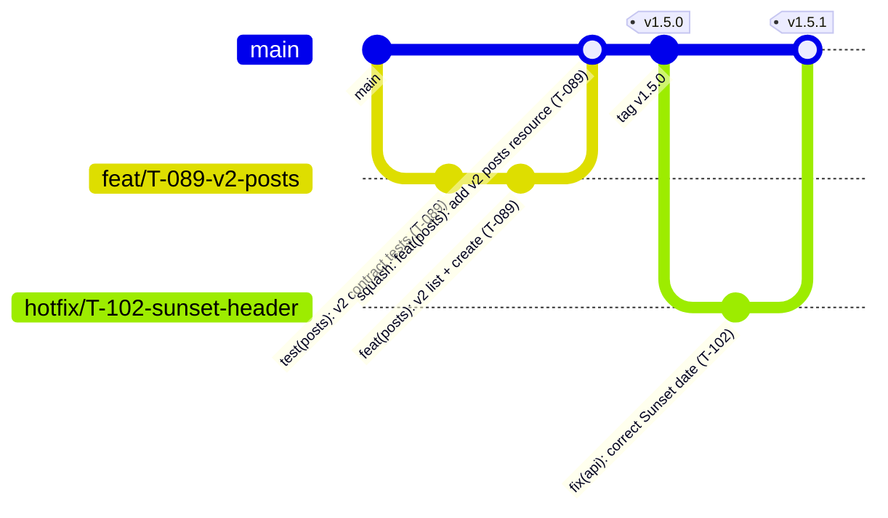
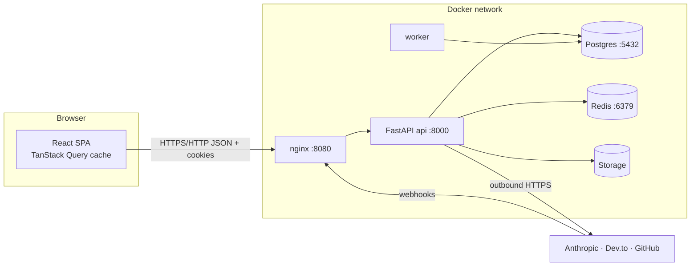

# Engineering Foundations — Blog Platform
_Reference for how this project is built, shipped and how a request actually travels. Claude Code: verify against the repo in T-081; fix the doc or list gaps, never guess._

## 1. SDLC in this repo
| Phase | Artifact / tool | Gate to next phase |
|---|---|---|
| Requirements | `docs/product.md` (FRs with acceptance criteria, out-of-scope list) | Every FR testable; open questions listed |
| Design | `docs/architecture.md`, `docs/design.md`, `docs/rules.md` (BRs) | Claude Code comprehension check finds no contradictions |
| Plan | `docs/tasks.md` (T-IDs, acceptance, topic refs) | Task has acceptance criterion |
| Build | Feature branch `feat/T-XXX-…`, Conventional Commits | Tests written with/before code |
| Verify | `make ci` locally → GitHub Actions (lint, tests, migrations, scans) | All required checks green |
| Review | Pull request template + self-review + CODEOWNERS | Approved, ≤ 400 changed lines |
| Release | SemVer tag → images on GHCR → CHANGELOG | Restore drill passed (BR-81) |
| Deploy | `make deploy VERSION=…` (backup → migrate → restart → ready gate) | `/health/ready` green or auto-rollback |
| Operate | Grafana, logs, GlitchTip, audit log, runbooks | Alerts quiet; incidents noted |
| Learn | `docs/memory.md` (decisions, gotchas), `docs/performance.md` | Written the same day |

## 2. Git & GitHub workflow

Rules: rules.md → "Git workflow". Pre-commit hooks: ruff, eslint, shellcheck, gitleaks, commitlint.

## 3. Client–server architecture and responsibilities

| Concern | Frontend (React) | Backend (FastAPI) |
|---|---|---|
| Rendering, routing, form UX | ✓ | — |
| Input validation | Fast feedback only | Authoritative (Pydantic) |
| Authentication & authorisation | Shows/hides via `/me/permissions` | Enforces every request |
| Business rules (BR-xx) | Never | Services only |
| Data persistence | Never (no browser storage of server data) | Repositories |
| Secrets | Never (anything `VITE_*` is public) | Env / Docker secrets |
| Third-party calls | Never directly | Integration adapters |

## 4. HTTP basics — as used here
- **Methods:** GET (read, safe), POST (create/async), PUT (idempotent set, e.g. like), PATCH (partial update, JSON Merge Patch in v2), DELETE.
- **Status codes:** see BR-86. 4xx = client can fix; 5xx = our fault; 502/503/504 = a dependency's fault.
- **Headers we rely on:** `Cookie`/`Set-Cookie` (session), `Origin` (CSRF check), `Content-Type` (415), `ETag`/`If-None-Match` (304), `If-Match` (412/428), `Idempotency-Key`, `Retry-After`, `Location`, `Link`, `Deprecation`/`Sunset`, `X-Request-ID`, `Server-Timing` (local).
- **Statelessness:** every request carries its own auth (cookie or Bearer PAT); no server affinity — any api replica can serve any request.

## 5. Request/response lifecycle (prod-like stack, `PATCH /api/v2/posts/{id}`)
1. Browser resolves `localhost` → 127.0.0.1 and connects to nginx on host port 8080.
2. nginx serves static assets itself; `/api/*` is proxied to `http://api:8000` — `api` is resolved by Docker's embedded DNS on the `internal` network.
3. Uvicorn parses HTTP into an ASGI request.
4. Middleware (outer → inner): request ID → security headers → gzip → rate limit → Origin/CSRF check → timing (local).
5. Router (controller) matches `/api/v2/posts/{post_id}`; Pydantic validates path, query, headers and body (400/415/422).
6. Dependencies (guards): current user (401) → not suspended (403) → tenant context (404) → load post scoped to tenant (404) → `require_permission(post:update)` (403/404) → `If-Match` check (428/412) → Idempotency (POST only).
7. Service applies business rules (BR-xx), calls repository; repository runs SQL in the request's DB session; audit row written in the same transaction.
8. Transaction commits; cache version bumped; outbound webhook job enqueued (after commit).
9. Response model (view) serialises the post; `ETag` computed; exception handler converts domain errors to problem+json.
10. Middleware adds headers, compresses, logs one JSON line with `request_id`, status, duration; metrics updated.
11. nginx returns the response; the SPA updates the TanStack Query cache for that post.

## 6. Ports
| Service | Container port | Host port (dev) | Host port (prod-like) | Notes |
|---|---|---|---|---|
| web (Vite dev) | 5173 | 5173 | — | dev only |
| web (nginx-unprivileged) | 8080 | — | 8080 | > 1024 so it runs as non-root |
| api | 8000 | 8000 | — (internal only) | reached via nginx in prod |
| db | 5432 | 5432 | — | never exposed in prod |
| redis | 6379 | 6379 | — | never exposed in prod |
| minio | 9000 / 9001 | 9000 / 9001 | 9000 | 9001 = console, dev only |
| prometheus / grafana / glitchtip | 9090 / 3000 / 8000 | 9090 / 3000 / 8001 | same (obs profile) | glitchtip mapped to 8001 to avoid clashing with api |
| smee client (webhook tunnel) | — | — | — | outbound only; forwards to `http://api:8000/api/v1/integrations/github/webhook` |

## 7. DNS in this project
- Inside compose, containers reach each other by **service name** (`db`, `redis`, `api`, `minio`) through Docker's embedded DNS; `localhost` inside a container means that container itself.
- From the browser, only `localhost:<host port>` works — hence `S3_ENDPOINT_INTERNAL` vs `S3_ENDPOINT_PUBLIC` (v2) and `API_BASE_URL` in `config.js` (v4).
- Outbound integrations resolve public DNS (`api.anthropic.com`, `dev.to`, `api.github.com`); failures surface as 502/504 via the resilient client.
- User-supplied URLs are resolved once, the IP is checked against the SSRF deny-list, and the connection goes to that vetted IP (BR-108).

## 8. Third-party provider limits (sources to confirm in T-092)
| Provider | Style | Auth | Limit we configure | Source |
|---|---|---|---|---|
| Anthropic | Official Python SDK | Platform API key (`x-api-key` handled by SDK) | Per-org limits from console; our per-user/day + monthly budget caps | https://docs.claude.com/en/api/overview |
| Dev.to (Forem) | Raw httpx | User API key header | Conservative bucket, confirm from Forem API docs | Forem API docs |
| GitHub | Raw httpx | OAuth token (Bearer) | Per-token hourly quota from response headers | GitHub REST API docs |
